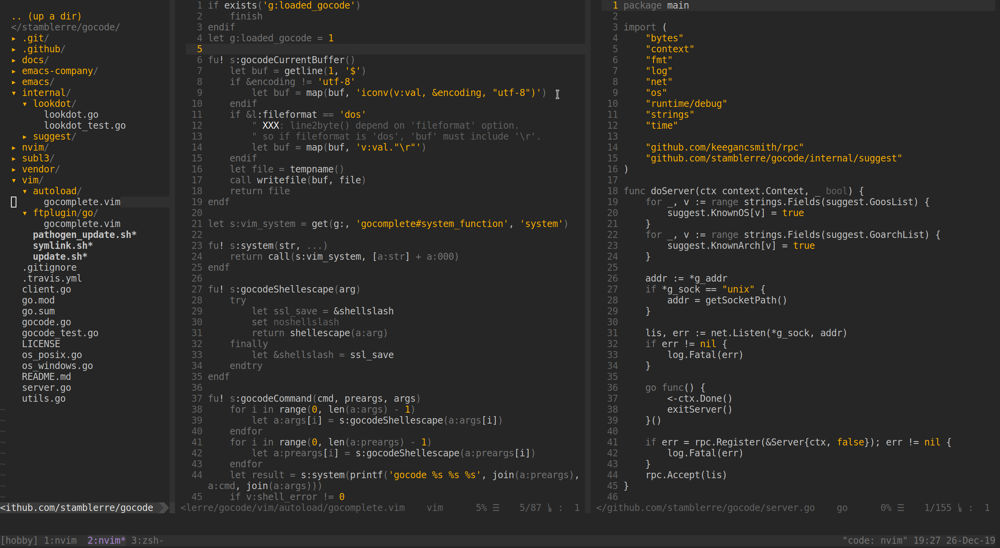

# monokrom.vim



Supports both 256 color and true color modes.


### Installation

Using `vim-plug`:

```
Plug 'alexanderheldt/monokrom.vim'
```


### Usage

To enable this color scheme, set it in your `.vimrc`:

```vim
colorscheme monokrom
```

### Terminal True Color Support

To enable true colors, set this in your `.vimrc`:

```vim
if has('nvim') || has('termguicolors')
    set termguicolors
endif
```

### Inspired by

- https://github.com/fxn/vim-monochrome
- https://github.com/Lokaltog/vim-monotone
- https://github.com/axvr/photon.vim
